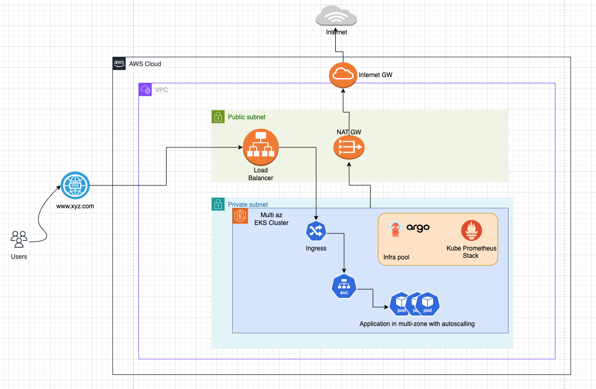
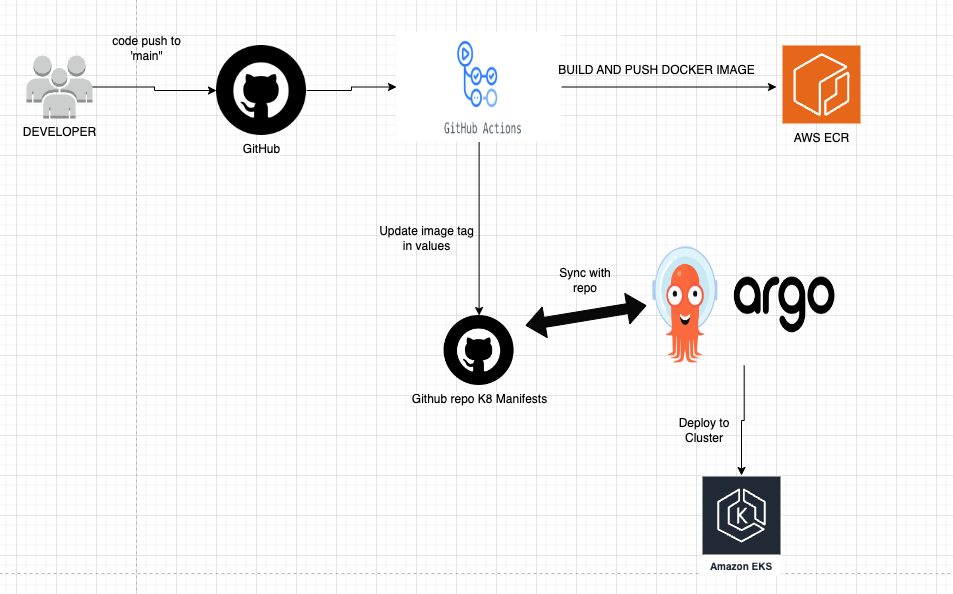
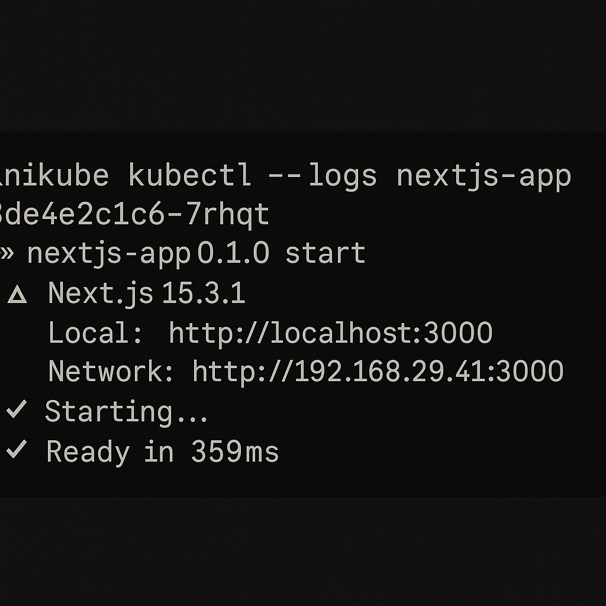
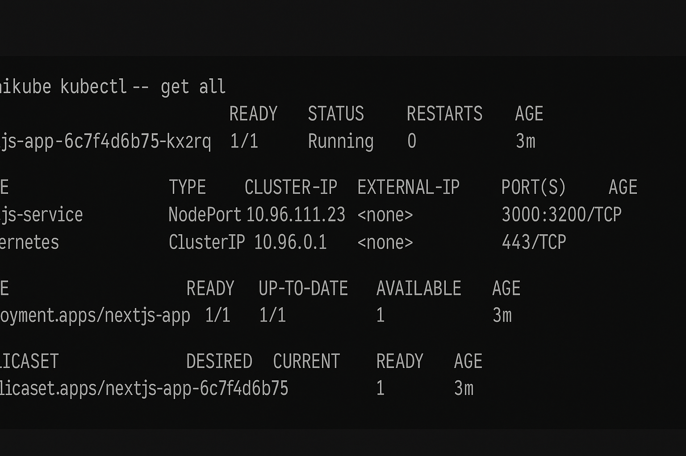

# NextJS Application -  GitOps in action using Kubernetes With Argo CD, Helm, GitHub Actions, and Montoring

## Introduction

This repository contains a architecture for a scalable and secure NextJS application with proper GitOps practices in-place.

## Features
- Sample NextJS Application: A simple NextJS app to showcase deployment workflows.
- Dockerfile: Containerize the NextJS app with an optimized, lightweight Docker image.
- ArgoCD Manifests: Declarative GitOps approach for continuous delivery to EKS.
- Terragrunt for EKS: Modular, DRY infrastructure as code to provision EKS clusters efficiently.
- CI/CD Pipelines: Automated pipelines for building, testing, and deploying the application using GitHub Actions (or other CI/CD tools).
- Scalable Design: Built with scalability, high availability, and best security practices in mind.

## Directory Structure

This repository includes the following components:

1. `/app` - Contains the application code (main.go) and Dockerfile.
2. `/terraform` - Infrastructure-related configuration, organized into three subfolders:
2. `/kubernetes` - Kubernetes ArgoCD and Production Ready Helm Charts Setup 
   - `/helm-charts` - Contains Helm charts for:
     - **base-chart** - The primary chart for deploying the NextJS application.
     - **argo-cd** - Helm chart for deploying Argo CD.
     - **monitoring-stack** - Helm chart for the monitoring setup.
     - **cert-manager** - Helm chart for the Cert Manger setup.
     - **external-dns** - External DNS setup for creating a DNS route when ingress is created
     - **external-secret-manager** - Secret Magnager to pull the secrets from AWS secret Manager 
   - `/argocd` - Contains configuration for Argo CD projects and applications, including:
     - `/apps` - Configuration for the app to deploy via Argo CD.
     - `/bootstrap` - Contains `root.yaml`, which automates application and project creation in Argo CD.
     - `/projects` - YAML files for Argo CD projects and ApplicationSets.
3. `.github` - Contains the GitHub Actions workflow file.

## Architecture Diagram

High Level Architecture Diagram

  

**NOTE**
- HPA is enabled on Application
- (optional) Multi-region EKS clusters could be used to support wide geographies

## Infrastructure Setup and Initial Deployment 

Please refer to this [README.md](docs/initial-setup.md) for details related to infra setup and deployment

## CI/CD

### Tools/Services used:
- Cloud: [AWS](https://aws.amazon.com/)
- Container Registry: [AWS ECR](https://hub.docker.com/)
- CI/CD Tools: [Github Action](https://github.com/features/actions) and [ArgoCD](https://argo-cd.readthedocs.io/en/stable/)

### Required Github Secrets:

- `AWS_ROLE`: Aws role arn: Required to login with AWS
- `AWS_REGION`: AWS Region
- `ECR_REPOSITORY_URI`: ECR Repo
- `GITHUB_TOKEN`: GITHUB PAT - used to push the image tag

### Automated Deployments using Github Action + ArgoCD

  

### NextJS app deployment on Minikube

  
  

#### Workflow Functioning

- On push to supported branche (master), the new dockerimage is build for the code within `/app` directory
- Dockerimage is tagged with the latest commit hash (SHORT SHA) and is pushed to ECR
- The latest tag is updated in the values file of argocd application
- The ArgoCD will poll and identify the change in the helm charts values file and will apply the changes to EKS cluster

**NOTE**: Make sure "AutoSync" is enabled in ArgoCD for these application project

# 🚀 Production-Ready Kubernetes Manifests

This repository contains Kubernetes configurations designed for **high availability**, **secure deployments**, **GitOps**, and **event-driven scalability**. These manifests are optimized for production environments, specifically tailored for applications running on EKS (Amazon Elastic Kubernetes Service).

---

## ✅ Key Features

### 🔁 High Availability & Scalability
- **Horizontal Pod Autoscaler (HPA)**: Automatically scales workloads based on CPU and memory usage.
- **Multi-region EKS Clusters**: Ensures global availability and resilience.
- **Resource Requests & Limits**: Predefined CPU and memory limits for stable and predictable performance.

### 🔐 Security
- **AWS Secrets Manager + External Secrets Operator**: Secure and seamless secrets management.
- **Cert-Manager**: Handles TLS certificates automatically with renewal support.
- **RBAC**: Fine-grained access control for least-privilege operations.

### 🔁 GitOps & CI/CD
- **Argo CD**: Declarative, Git-based deployment with drift detection and rollback capabilities.
- **Infrastructure vs. Application Separation**: Promotes maintainability and clean repo structure.
- **CI/CD Pipeline**: Automated image builds, tagging, and versioned deployment.

### 📊 Observability
- **Prometheus + Grafana**: Full monitoring and alerting stack.
- **Structured Logging & Metrics**: Clear logs for traceability and performance insights.
- **Health Probes**: Liveness and readiness probes to maintain service health.

### 🌐 Networking
- **External-DNS**: Automatically manages DNS records for services.
- **Ingress with TLS**: Secure ingress setup with automated certificate handling.
- **Network Policies**: Isolates services for improved security posture.

---

## TODO / Future Improvements
- Support to add user groups/roles RBAC in auth configmap (for easier onboarding of members to EKS)
- Integrate WAF 
- Event-Driven Autoscaling with KEDA